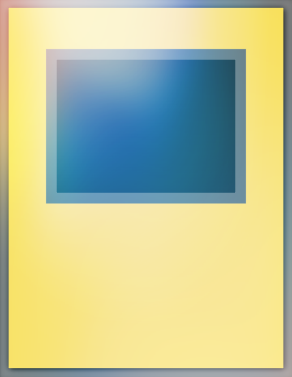
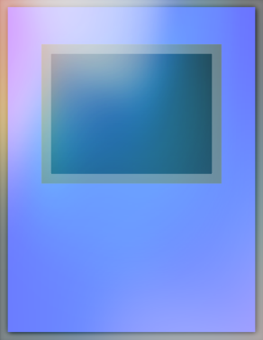

# Bash Duel Homepage

### Mostri con Effetto consentiti per il formato Bash Duel 

### Per vedere le altre carte consentite all'interno del formato segui i link in basso:

[Mostri Normali](../NormalMonsters/MostriNormali.md)

[Mostri Rituale](../RitualMonsters/MostriRituale.md)

[Banlist](../README.md)

[Mostri dell'Extra Deck](../ExtraDeckMonsters/MostriExtraDeck.md)

[Magie](../Spells/Magie.md)

[Trappole](../Traps/Trappole.md)

[Entra nel server Discord di Bash Duel](https://discord.gg/5XVExPRbbJ)

---

| Divinità:                                                     | Tipo:                                                   :|
|:-------------------------------------------------------------:|:--------------------------------------------------------:|
| Slifer il Drago del Cielo                                     |  |
| Drago Alato di Ra                                             |  |
| Obelisk il Tormentatore                                       |  |

---

| Mostri con Effetto:                                           | Tipo:                                                    |
|:-------------------------------------------------------------:|:--------------------------------------------------------:|
| Abile Mago Blu                                                |  |
| Abile Mago Nero                                               |  |
| Abile Mago Rosso                                              |  |
| Abitante delle Profondità                                     |  |
| Alchimista Dimensionale                                       |  |
| Ali Cyberoscure                                               |  |
| Ambulanceroid                                                 |  |
| Angelo O7                                                     |  |
| Angelo Oscuro - EROE del Destino                              |  |
| Angelo Scheletrico                                            |  |
| Anima Oscura Posseduta                                        |  |
| Annullatore di Magia                                          |  |
| Anziano Mago Vendicativo                                      |  |
| Ape Soldato Arruolata                                         |  |
| Apprendista Amazoness                                         |  |
| Arcidemone di Gilfer                                          |  |
| Arcidemone Lanciere                                           |  |
| Artiglio Cyberoscuro                                          |  |
| Ascia da Guerra Infuriata                                     |  |
| Assalitore Notturno                                           |  |
| Assalitrice Custode di Tombe                                  |  |
| Babbo Artigli                                                 |  |
| Babbuino Verde Difensore della Foresta                        |  |
| Bazoo il Mangia-Anima                                         |  |
| Behemot Bifronte                                              |  |
| Behemot il Re degli Animali                                   |  |
| Berfomet                                                      |  |
| Bestia Cristallo Aquila Cobalto                               |  |
| Bestia Cristallo Carbuncle Rubino                             |  |
| Bestia Cristallo Gatto Ametista                               |  |
| Bestia Cristallo Mammut Ambra                                 |  |
| Bestia Cristallo Pegaso Zaffiro                               |  |
| Bestia Cristallo Tartaruga Smeraldo                           |  |
| Bestia Cristallo Tigre Topazio                                |  |
| Bestia della Spada Folle                                      |  |
| Bestia Demoneterno                                            |  |
| Bestia Fantasma Ali-Incrociate                                |  |
| Bestia Fantasma Corno-Selvaggio                               |  |
| Bestia Fantasma Pegaso-Tuono                                  |  |
| Bestia-Ingranaggio Antico                                     |  |
| Betonieroid                                                   |  |
| Bladedge EROE Elementale                                      |  |
| Blazeman EROE Elementale                                      |  |
| Blocco Flint                                                  |  |
| Bonzo Solitario                                               |  |
| Bowganian                                                     |  |
| Bozzolo Dell'Evoluzione                                       |  |
| Brachiodonte Nero                                             |  |
| Bubbleman EROE Elementale                                     |  |
| Byser Shock                                                   |  |
| Caccia di Giada                                               |  |
| Cannoniere - Custode di Tombe                                 |  |
| Carboneddon                                                   |  |
| Catapultatore Oscuro                                          |  |
| Cavaletta Pungente                                            |  |
| Cavaliere Comandante                                          |  |
| Cavaliere della Costa                                         |  |
| Cavaliere Fantasma dello Sciacallo                            |  |
| Cavaliere Lama                                                |  |
| Cavaliere-Ingranaggio Antico                                  |  |
| Chiron il Saggio                                              |  |
| Clessidra della Vita                                          |  |
| Clown del Sogno                                               |  |
| Clown Ryu-Kishin                                              |  |
| Clown Stupido                                                 |  |
| Coccinella Dorata                                             |  |
| Comandante - Custode di Tombe                                 |  |
| Comandante Decaduto                                           |  |
| Combattente delle Lame                                        |  |
| Combattente delle Lame Toon                                   |  |
| Combattente delle Lame, il Maestro di Spada della Distruzione |  |
| Congegno-Ingranaggio Antico                                   |  |
| Copiatore                                                     |  |
| Corno Cyberoscuro                                             |  |
| Corvo D.D.                                                    |  |
| Corvo Rituale                                                 |  |
| Creatura Umida                                                |  |
| Cucciolo di Occhi Rossi                                       |  |
| Cyber Drago                                                   |  |
| Cyber Etoile                                                  |  |
| Cyber Fenice                                                  |  |
| Cyber Ginnasta                                                |  |
| Cyber Lady arpia                                              |  |
| Cyber Naga                                                    |  |
| Cyber Prima                                                   |  |
| Cyber Tutù                                                    |  |
| Danipon                                                       |  |
| Dark Scorpion - Gorg il Forte                                 |  |
| Dark Scorpion - Meanae la Spina                               |  |
| Dasher - EROE del Destino                                     |  |
| Dea dal Terzo Occhio                                          |  |
| Dekoichi la Locomotiva da Battaglia Incantata                 |  |
| Delta Tri                                                     |  |
| Demone Fantasma                                               |  |
| Demone Leggendario                                            |  |
| Demone Megacyber                                              |  |
| Demone Minore                                                 |  |
| Des Gardius, la Bestia Mascherata                             |  |
| Des Koala                                                     |  |
| Des Lacooda                                                   |  |
| Des Viser                                                     |  |
| Destino Fuoco Vulcanico                                       |  |
| Devastatore Vulcanico                                         |  |
| Dinosauro Elementale                                          |  |
| Dinosauro Super Antico                                        |  |
| Dispensatore di Paura - EROE del Destino                      |  |
| Disperazione dall'Oscurità                                    |  |
| Djinn Pronosticatore dei Rituali                              |  |
| Djinn Protettore dei Rituali                                  |  |
| Dogma - EROE del Destino                                      |  |
| Dogoran, il Kaiju Folle Fiamma                                |  |
| Don Zaloog                                                    |  |
| Doppio Coston                                                 |  |
| Draghetto delle Arpie                                         |  |
| Drago Acquatico                                               |  |
| Drago Acquatico Grappolo                                      |  |
| Drago Arcobaleno                                              |  |
| Drago Arcobaleno Oscuro                                       |  |
| Drago Armato LV3                                              |  |
| Drago Armato LV5                                              |  |
| Drago Armato LV7                                              |  |
| Drago di Ghiaccio e Fiamma                                    |  |
| Drago Doppia Canna                                            |  |
| Drago Esplosivo                                               |  |
| Drago Lanciere                                                |  |
| Drago Nero Metallico Occhi Rossi                              |  |
| Drago Oscuro Occhi Rossi                                      |  |
| Drago Revolver                                                |  |
| Drago Revolver Toon                                           |  |
| Drago Sputafuoco                                              |  |
| Drago Tiranno                                                 |  |
| Drago Toon Occhi Blu                                          |  |
| Drago Toon Occhi Rossi                                        |  |
| Drillago                                                      |  |
| Drillroid                                                     |  |
| DUCKER Cannone Mobile                                         |  |
| Duoterion                                                     |  |
| Elfi Gemelli Toon                                             |  |
| Epuratore della Luce                                          |  |
| Epuratore della Radianza                                      |  |
| Evocatore Drago Blu                                           |  |
| Expressroid                                                   |  |
| Faccia da Uccello                                             |  |
| Folletto della Fiamma Infuriato                               |  |
| Forza Esiliata                                                |  |
| Frantumatore del Blu Perduto                                  |  |
| Frantumatore Vulcanico                                        |  |
| Freed il Generale Senza Avversari                             |  |
| Gaap, il Soldato Divino                                       |  |
| Gaia il Cavaliere del Vento Oscuro                            |  |
| Gaia il Cavaliere in Carica                                   |  |
| Gearfried il Cavaliere di Ferro                               |  |
| Genesi Vampira                                                |  |
| Gentilemandra                                                 |  |
| Giara Assorbente                                              |  |
| Gilasaurus                                                    |  |
| Gilford il Fulmine                                            |  |
| Gilford la Leggenda                                           |  |
| Gokipon                                                       |  |
| Golem Blocco                                                  |  |
| Golem di Lava                                                 |  |
| Golem-Ingranaggio Antico                                      |  |
| Golem-Ingranaggio Antico Toon                                 |  |
| Grande Falena Perfetta                                        |  |
| Grande Ladro Spettrale                                        |  |
| Grandmarg Monarca della Terra                                 |  |
| Granitino                                                     |  |
| Guardia Misteriosa                                            |  |
| Guardiano del Cancello                                        |  |
| Guardie Regali della Tempesta di Fuoco                        |  |
| Guerriero Magnetico Delta                                     |  |
| Guerriero Razzo                                               |  |
| Guscio Vulcanico                                              |  |
| Gyroid                                                        |  |
| Ha Des Sovrano Oscuro                                         |  |
| Helpoemer                                                     |  |
| Hydrogeddon                                                   |  |
| Il Cavallo di Troia                                           |  |
| Il Mistico                                                    |  |
| Imairuka                                                      |  |
| Impresario di Pompe Funebri Magico                            |  |
| Incantatore Rosso Oscuro                                      |  |
| Incubo Tebano                                                 |  |
| Infiltratore - Custode di Tombe                               |  |
| Ingegnere-Ingranaggio Antico                                  |  |
| Ingranaggio Antico                                            |  |
| Insetto Regina                                                |  |
| Iper Testa-Martello                                           |  |
| Jeroid Oscuro                                                 |  |
| Jirai Gumo                                                    |  |
| Joan Angelo Custode                                           |  |
| Jurrac Herra                                                  |  |
| Jurrac Iguanon                                                |  |
| Jurrac Protos                                                 |  |
| Jurrac Spinos                                                 |  |
| Jurrac Stauriko                                               |  |
| Jurrac Tyrannus                                               |  |
| Kaibaman                                                      |  |
| Kaiser Cavalluccio Marino                                     |  |
| Kaiser Glider                                                 |  |
| Kangaroo Mortale                                              |  |
| Kazejin                                                       |  |
| Kelbek                                                        |  |
| Keldo                                                         |  |
| Koala Marino                                                  |  |
| Kotetsu Fabbro del Ferro                                      |  |
| Kuriboh                                                       |  |
| Kuriboh Alato                                                 |  |
| Kuriboh Sfera                                                 |  |
| Kycoo il Distruttore di Spettri                               |  |
| Lady Arpia 1                                                  |  |
| Lady Arpia 2                                                  |  |
| Lady Arpia 3                                                  |  |
| Lanciere - Custode di Tombe                                   |  |
| Legione Demone Giullare                                       |  |
| Levia-Dragone - Dedalo                                        |  |
| Lo Spirito della Roccia                                       |  |
| Lucertola Folata                                              |  |
| Lucio Nero LV4                                                |  |
| Lucio Nero LV6                                                |  |
| Lucio Nero LV8                                                |  |
| Lupo Bifronte                                                 |  |
| Lupo da Guerra Nero-Pece                                      |  |
| Maestra delle Catene Amazoness                                |  |
| Maestro Artigiano Gamil                                       |  |
| Maestro dei Pupazzi                                           |  |
| Maestro di Lame - EROE del Destino                            |  |
| Maga Bianca Pikeru                                            |  |
| Mago Apprendista                                              |  |
| Mago Cibernetico                                              |  |
| Mago del Chaos Oscuro                                         |  |
| Mago Nero del Chaos                                           |  |
| Mago Nero Toon                                                |  |
| Magus Senza Volto Illusionista                                |  |
| Maha Vailo                                                    |  |
| Maledizione - Custode di Tombe                                |  |
| Malicious - EROE del Destino                                  |  |
| Mandragola Pianta Magica                                      |  |
| Manga Ryu-Ran                                                 |  |
| Manticora dell'Oscurità                                       |  |
| Maryokutai                                                    |  |
| Maschera dell'Oscurità                                        |  |
| Mefist il Generale Infernale                                  |  |
| Mek Fusoliera                                                 |  |
| Mek Pacificatore                                              |  |
| Metalzoa                                                      |  |
| Mimic Oscuro LV1                                              |  |
| Mimic Oscuro LV3                                              |  |
| Mudora                                                        |  |
| Mummia Rigenerante                                            |  |
| Muro Illusorio                                                |  |
| Nano Demoneterno                                              |  |
| Nave Yomi                                                     |  |
| Necromante Hannibal                                           |  |
| Necro-Ombra EROE Elementale                                   |  |
| Newdoria                                                      |  |
| Ninja Fulmineo                                                |  |
| Nobile dell'Oscurità                                          |  |
| Nucleo Distruttore Alleato della Giustizia                    |  |
| Nuvola Rumorosa il Serpente Tempesta                          |  |
| Ojama Blu                                                     |  |
| Ojama Rosso                                                   |  |
| Oracolo - Custode di Tombe                                    |  |
| Oxygeddon                                                     |  |
| Parshath Cavaliere Volante                                    |  |
| Paura Oscura                                                  |  |
| Pescatore Leggendario                                         |  |
| Pescatore Leggendario II                                      |  |
| Pesce Cyborg Impiantatore                                     |  |
| Piattaforma di Supporto per Mezzi Pesanti                     |  |
| Piccola-Guardialata                                           |  |
| Plasma - EROE del Destino                                     |  |
| Predone Cibernetico                                           |  |
| Principessa Insetto                                           |  |
| Prodigio del Turbine                                          |  |
| Profeta Cristallo                                             |  |
| Proiettile Sonico                                             |  |
| Prometheus, Re delle Ombre                                    |  |
| Proto-Cyber Drago                                             |  |
| Pterodattilo Nero                                             |  |
| Ragazza Maga Nera                                             |  |
| Ragazzo Diamante - EROE del Destino                           |  |
| Rana-Pescatrice Barbuta                                       |  |
| Ratto Gigante                                                 |  |
| Razzo Vulcanico                                               |  |
| Re dei Servitori del Teschio                                  |  |
| Reclutatore - Custode di Tombe                                |  |
| Rescueroid                                                    |  |
| Ricaricatore Folle                                            |  |
| Robot Soccorittore                                            |  |
| Ryu Kokki                                                     |  |
| Sacerdotessa - Custode di Tombe                               |  |
| Saggio Amazoness                                              |  |
| Samurai Sasuke                                                |  |
| Sanga del Tuono                                               |  |
| Scaratron                                                     |  |
| Scheletro Cyberoscuro                                         |  |
| Sciamano - Custode di Tombe                                   |  |
| Sciame di Locuste                                             |  |
| Sciame di Scarabei                                            |  |
| Scimitarra Beta                                               |  |
| Segugio Meccanico                                             |  |
| Senju dalle 1000 Mani                                         |  |
| Serpente Sinistro                                             |  |
| Sfera di Distruzione                                          |  |
| Signora Assaltatrice delle Fiamme                             |  |
| Signora Guerriera delle Terre Desolate                        |  |
| Signore dei Vampiri                                           |  |
| Signore del Fato - EROE del Destino                           |  |
| Signore di D.                                                 |  |
| Sirena Toon                                                   |  |
| Soldato-Ingranaggio Antico                                    |  |
| Sorelle Arpie                                                 |  |
| Spadaccino Sacro - Gearfried il Cavaliere di Ferro            |  |
| Spia Amazoness                                                |  |
| Spirito delle Fiamme                                          |  |
| Spirito Ryu                                                   |  |
| Statua di Pietra degli Aztechi                                |  |
| Stealthroid                                                   |  |
| Steamroid                                                     |  |
| Stegosauro Oscuro                                             |  |
| Stregone del Tempo                                            |  |
| Stregone Mascherato Toon                                      |  |
| Submarineroid                                                 |  |
| Succhiasangue                                                 |  |
| Suijin                                                        |  |
| Tartaruga UFO                                                 |  |
| Teschio Evocato Toon                                          |  |
| Tigre Zombie                                                  |  |
| Tiranno Oscuro                                                |  |
| Triceratopo oscuro                                            |  |
| Truckroid                                                     |  |
| Truppa Drago                                                  |  |
| Uccello Sonico                                                |  |
| UFOroid                                                       |  |
| Un Gatto della Sfortuna                                       |  |
| Valkyrion Guerriero Magnetico                                 |  |
| Vassallo - Custode di Tombe                                   |  |
| Verme Bestiale                                                |  |
| Victory Viper XX03                                            |  |
| W-Catapulta Ala                                               |  |
| Wildheart EROE Elementale                                     |  |
| Wombato Des                                                   |  |
| Wroughtweiller                                                |  |
| Y-Testa Drago                                                 |  |
| Z-Carro Armato Metallico                                      |  |
| Zolga                                                         |  |
| Zombie Clown                                                  |  |
| Zombie Goblin                                                 |  |
| Zombina                                                       |  |
| Zombyra l'Oscuro                                              |  |
