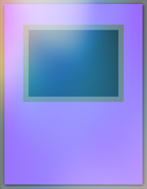

# Bash Duel Homepage

### Mostri dell'Extra Deck consentiti nel formato Bash Duel 

### Per vedere le altre carte consentite all'interno del formato segui i link in basso:

[Mostri Normali](../NormalMonsters/MostriNormali.md)

[Mostri Rituale](../RitualMonsters/MostriRituale.md)

[Mostri con Effetto](../EffectMonsters/MostriEffetto.md)

[Banlist](../README.md)

[Magie](../Spells//Magie.md)

[Trappole](../Traps/Trappole.md)

[Entra nel server Discord di Bash Duel](https://discord.gg/5XVExPRbbJ)

---

|Mostri Extra Deck:                       |Tipo:                                                       |
|:---------------------------------------:|:----------------------------------------------------------:|
| Bastione Distruttore EROE Elementale    |  |
| Cavaliere Joker Arcano                  |  |
| Cavaliere Ojama                         |  |
| Cavaliere Rabbioso                      |  |
| Cavaliere Teschio                       |  |
| Chimera la Mitica Bestia Volante        |  |
| Cyber Lama                              |  |
| Darkbright EROE Elementale              |  |
| Drago Cyber Finale                      |  |
| Drago Cyberoscuro                       |  |
| Drago Millenario                        |  |
| Drago Nero Meteora                      |  |
| Drago Occhi Blu Finale                  |  |
| Drago Spada dell'Alligatore             |  |
| Drago Supremo Chimeratech               |  |
| Dragone del Destino Finale              |  |
| Electrum EROE Elementale                |  |
| Gaia il Dragone                         |  |
| Gigante del Tuono EROE Elementale       |  |
| Golem-Ingranaggio Antico Finale         |  |
| Grande Mammut di Goldfine               |  |
| Guerriero UFOroid                       |  |
| Limite dei 1000 Occhi                   |  |
| Maestro di Oz                           |  |
| Mariner EROE Elementale                 |  |
| Necroid-Sciamano EROE Elementale        |  |
| Nova Master EROE Elementale             |  |
| Paladino Oscuro                         |  |
| Pericoloso - EROE del Destino           |  |
| Plasma Vice EROE Elementale             |  |
| Re Ojama                                |  |
| Rescueroid Ambulanza                    |  |
| Ryu Senshi                              |  |
| Sanwitch                                |  |
| Spadaccino di Fuoco                     |  |
| Steam Gyroid                            |  |
| Super Vehicroid - Unione Stealth        |  |
| Super Vehicroid Jumbo Drill             |  |
| Supradrago Arcobaleno                   |  |
| Tandem Cycroid                          |  |
| Tempesta EROE Elementale                |  |
| Uomo Alato della Fiamma EROE Elementale |  |
| Uomo Alato Selvaggio EROE Elementale    |  |
| Vapore Curatore EROE Elementale         |  |
| VW-Catapulta Tigre                      |  |
| VWXYZ-Cannone Drago Catapulta           |  |
| XYZ-Cannone Drago                       |  |
| XZ-Cannone Carroarmato                  |  |
| YZ-Drago Carrarmato                     |  |
