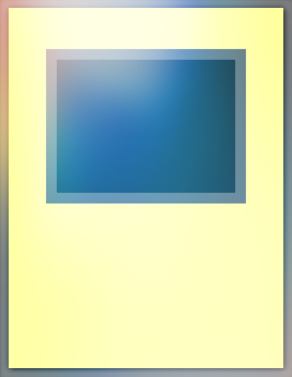

# Bash Duel Homepage

### Mostri Normali consentiti nel formato Bash Duel 

### Per vedere le altre carte consentite all'interno del formato segui i link in basso:

[Banlist](../README.md)

[Mostri Rituale](../RitualMonsters/MostriRituale.md)

[Mostri con Effetto](../EffectMonsters/MostriEffetto.md)

[Mostri dell'Extra Deck](../ExtraDeckMonsters/MostriExtraDeck.md)

[Magie](../Spells/Magie.md)

[Trappole](../Traps/Trappole.md)

[Entra nel server Discord di Bash Duel](https://discord.gg/5PpMBYZf)

---

|Mostri Normali:                    |Tipo:                                                       |
|:---------------------------------:|:----------------------------------------------------------:|
| Abisso Splendente                 |  |
| Alinsection                       |  |
| Alligatore Toon                   |  |
| Anatema del Drago                 |  |
| Anthrosaurus                      |  |
| Antico Cervello                   |  |
| Ascia da Guerra                   |  |
| Avian EROE Elementale             |  |
| Bambola Mortale                   |  |
| Bestia di Talwar                  |  |
| Bokoichi il Vagone Spaventoso     |  |
| Burstrinatrix EROE Elementale     |  |
| Cacciatore di Colli               |  |
| Capelli di Serpente               |  |
| Castoro Guerriero                 |  |
| Cavaliere del Jack                |  |
| Cavaliere del Re                  |  |
| Cavaliere della Regina            |  |
| Cavaliere Robotico                |  |
| Centauro Mistico                  |  |
| Clausolas Alleato della Giustizia |  |
| Clayman EROE Elementale           |  |
| Coniglio Oscuro                   |  |
| Conte del testamento              |  |
| Corvo Coda-di-Frusta              |  |
| Cucciolo di Drago                 |  |
| Custode del Cancello              |  |
| Cycroid                           |  |
| Demone Selvaggio                  |  |
| Dokuroyaiba                       |  |
| Drago Alato #1                    |  |
| Drago Avido #2                    |  |
| Drago Bianco Occhi Blu            |  |
| Drago Cacciatore                  |  |
| Drago Meteora                     |  |
| Drago Nero Occhi Rossi            |  |
| Drago Serpente Notturno           |  |
| Drago Strisciante #2              |  |
| Drago Zombie                      |  |
| Elfo Mistico                      |  |
| Fatasma Magico                    |  |
| Gagagigo                          |  |
| Gaia il Cavaliere                 |  |
| Gazelle, Re delle Bestie Mitiche  |  |
| Genio della Lampada               |  |
| Giga Gagagigo                     |  |
| Gigante Hitotsu-Me                |  |
| Gilgarth                          |  |
| Girochin Kuwagata                 |  |
| Golem Distruttore                 |  |
| Grande Antico Tiki                |  |
| Grande Insetto                    |  |
| Grande Koala                      |  |
| Guardiano Celtico                 |  |
| Guerriero Dai Grepher             |  |
| Guerriero Magnetico Alfa          |  |
| Guerriero Magnetico Beta          |  |
| Guerriero Magnetico Gamma         |  |
| Hyozanryu                         |  |
| Idolo dai 1000 Occhi              |  |
| Il Cavaliere Senza Testa          |  |
| Il Fantasma dei Sogni Scomparsi   |  |
| Il Giudicatore                    |  |
| Inpachi Carbone                   |  |
| Inpachi Fiammegiante              |  |
| Insetto della Foresta             |  |
| Insetto Metallo Corazzato         |  |
| Kabazauls                         |  |
| Kairyu-Shin                       |  |
| Kumootoko                         |  |
| Lama Oscura                       |  |
| Macchina Pendolo                  |  |
| Mago delle Acque                  |  |
| Mago Nero                         |  |
| Mago Senza Volto Illusionista     |  |
| Mangiatore di Vita                |  |
| Mannaia Alata                     |  |
| Mantide Imperatrice               |  |
| Masaki lo Spadaccino Leggendario  |  |
| Meccacciatore                     |  |
| Mech-Soldato Gigante              |  |
| Mega Squalo Bianco                |  |
| Melchid la Bestia Quattro Facce   |  |
| Melma Cangiante                   |  |
| Mietitore di Fuoco                |  |
| Mokey Mokey                       |  |
| Mura Labirintiche                 |  |
| Ojama Giallo                      |  |
| Ojama Nero                        |  |
| Ojama Verde                       |  |
| Ombra dell'Oscurità               |  |
| Opticlops                         |  |
| Papera Sonica                     |  |
| Pappadragallo                     |  |
| Pattinatrice Lama                 |  |
| Pesce Matto                       |  |
| Piccola Falena                    |  |
| Predatore Vorse                   |  |
| Predone d'Ascia                   |  |
| Prigioniero Oscuro                |  |
| Ragazza Arciere                   |  |
| Ragno Lancia-missili              |  |
| Ryu-Kishin Potenziato             |  |
| Saggi, Clown Oscuro               |  |
| Sciabolasaurus                    |  |
| Scizzar il Coraggioso             |  |
| Servitore del Teschio             |  |
| Signore delle Fiamme              |  |
| Slot Machine                      |  |
| Soldato di Pietra                 |  |
| Spada dell'Alligatore             |  |
| Spada in Agguato                  |  |
| Sparkman EROE Elementale          |  |
| Spettro Ombra                     |  |
| Spirito Terralegato               |  |
| Strega Oscura Dunares             |  |
| Teschio Evocato                   |  |
| Tirannosauro Rex a Due Teste      |  |
| Tomozaurus                        |  |
| Urabysauro                        |  |
| V-Tigre Jet                       |  |
| Wetha                             |  |
| X-Testa Cannone                   |  |
| Yaiba il Robot                    |  |
| Zanna d'Argento                   |  |
| Zoa                               |  |
| Zombie Corazzato                  |  |
