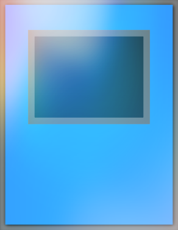

# Bash Duel Homepage

### Mostri Rituale consentiti nel formato Bash Duel 

### Per vedere le altre carte consentite all'interno del formato segui i link in basso:

[Mostri Normali](../NormalMonsters/MostriNormali.md)

[Banlist](../README.md)

[Mostri con Effetto](../EffectMonsters/MostriEffetto.md)

[Mostri dell'Extra Deck](../ExtraDeckMonsters/MostriExtraDeck.md)

[Magie](../Spells/Magie.md)

[Trappole](../Traps/Trappole.md)

[Entra nel server Discord di Bash Duel](https://discord.gg/5XVExPRbbJ)

---

|Mostri Rituali:            |Tipo:                                                       |
|:-------------------------:|:----------------------------------------------------------:|
| Abbandono                 |  |
| Balena Fortezza           |  |
| Cyber Angelo Benten       |  |
| Cyber Angelo Idaten       |  |
| Cyber Angelo Izana        |  |
| Dokurorider               |  |
| Glorioso Soldato Nero     |  |
| La Bestia Mascherata      |  |
| Paladino del Drago Bianco |  |
| Prestazione della Spada   |  |
| Super Leone da Guerra     |  |
