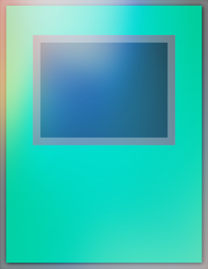

# Bash Duel Homepage

### Carte Magia consentite nel formato Bash Duel 

### Per vedere le altre carte consentite all'interno del formato segui i link in basso:

[Mostri Normali](../NormalMonsters/MostriNormali.md)

[Mostri Rituale](../RitualMonsters/MostriRituale.md)

[Mostri con Effetto](../EffectMonsters/MostriEffetto.md)

[Mostri dell'Extra Deck](../ExtraDeckMonsters/MostriExtraDeck.md)

[Banlist](../README.md)

[Trappole](../Traps/Trappole.md)

[Entra nel server Discord di Bash Duel](https://discord.gg/5PpMBYZf)

---

| Magie:                                     |Tipo:                                                       |
|:------------------------------------------:|:----------------------------------------------------------:|
| 7 Completati                               |  |
| Acceleratore Fiammata                      |  |
| Acceleratore Tri-Fiammata                  |  |
| Agnelli Dispersi                           |  |
| Albero di Cristallo                        |  |
| Alza Calore Corporeo                       |  |
| Amplificatore                              |  |
| Amuleto dell'Ambizione                     |  |
| Annulla Carta Magia                        |  |
| Antica Città Rovine Arcobaleno             |  |
| Arma Fusione                               |  |
| Arma Rituale                               |  |
| Armatura Insetto con Cannone Laser         |  |
| Armatura Laser                             |  |
| Armeria Nascosta                           |  |
| Arte Avanzata del Rituale                  |  |
| Arte dell'Evocatore                        |  |
| Ascia Gravitazionale - Grarl               |  |
| Attaccare la Luna!                         |  |
| Attacco Mago Nero                          |  |
| Avamposto                                  |  |
| Avanzata delle Carte                       |  |
| Bacchetta Miracolosa                       |  |
| Barriera Arcana                            |  |
| Benedizione Cristallo                      |  |
| Benedizione di Sebek                       |  |
| Blocca-Attacco                             |  |
| Cambio Arma                                |  |
| Campo Magnetico                            |  |
| Castello-Ingranaggio Antico                |  |
| Cestus di Dagla                            |  |
| Circo Goblin                               |  |
| Città degli Ingranaggi                     |  |
| Città Oscura                               |  |
| Colpo di Lancia Spirale                    |  |
| Cristallo Viola                            |  |
| Cyber Scudo                                |  |
| Dadi Graziosi                              |  |
| Dadotifone                                 |  |
| Dedizione alla Luce e all'Oscurità         |  |
| Defusione                                  |  |
| Destino Silente                            |  |
| Differente Capsula Dimensionale            |  |
| Dispositivo di Apprendimento Usa e Getta   |  |
| Distruzione Schiacciante                   |  |
| Dividi la Sofferenza                       |  |
| Dono dell'Elefante Bianco                  |  |
| Doppia Evocazione                          |  |
| Doppio Ciclone                             |  |
| Egotista Elegante                          |  |
| Eliminazione del Guerriero                 |  |
| Emblema dell'Ammazzi Draghi                |  |
| Eredità Amazoness                          |  |
| Eruzione Oscura                            |  |
| Esplosione a Onde Soniche                  |  |
| Esplosione dello Scudo                     |  |
| Esplosione Mokey Mokey                     |  |
| Fabbrica di Macchine                       |  |
| Fascino dell'Oscurità                      |  |
| Flamberga Spezza-Malvagi - Baou            |  |
| Flauto Evoca-Draghi                        |  |
| Flint                                      |  |
| Foglio Illustrativo Toon                   |  |
| Foresta                                    |  |
| Foresta Spirituale                         |  |
| Formazione di Fuoco - Tenki                |  |
| Formula Magica                             |  |
| Fossile Vivente                            |  |
| Fuoco Selvaggio                            |  |
| Fusione Futura                             |  |
| Fusione Soldato Spada della Distruzione    |  |
| Fusione Sovraccarico                       |  |
| Gabbia Insetto                             |  |
| Giuramento degli Arcidemoni                |  |
| Giuramento della Balena Fortezza           |  |
| Grande Destino                             |  |
| Grattacielo                                |  |
| Grattacielo 2 - La Città degli Eroi        |  |
| H - Ho il Cuore in Fiamme                  |  |
| Hangar Unione                              |  |
| Il Guerriero Sopravvissuto                 |  |
| Il Pupazzo Magico del Sovrano Oscuro       |  |
| Impatto Cyberoscuro!                       |  |
| Impianto di Riciclaggio Fusione            |  |
| Industria Oscura della Produzione di Massa |  |
| Inizio delle Danze                         |  |
| Inverti Creatura                           |  |
| L'Inizio della Fine                        |  |
| La Grande Mandria                          |  |
| La Grande Marcia degli Animali             |  |
| La Tomba Vuota                             |  |
| Lama Accecante                             |  |
| Lancio del Martello                        |  |
| Lande Desolate                             |  |
| Legame - D2O                               |  |
| Legame - H2O                               |  |
| Libro della Luna                           |  |
| Libro della Vita                           |  |
| Line di Montaggio delle Macchine           |  |
| Livello Superiore!                         |  |
| Maghi Riuniti                              |  |
| Maledizione della Bestia Mascherata        |  |
| Maschera del Maledetto                     |  |
| Maschera dell'Eredità                      |  |
| Maschera della Brutalità                   |  |
| Mezza Chiusura                             |  |
| Mille Coltelli                             |  |
| Mondo Toon                                 |  |
| Montagna                                   |  |
| Murena dell'Avidità                        |  |
| Natura Selvaggia                           |  |
| Offerte al Condannato                      |  |
| Ojamagia                                   |  |
| Ojamatch                                   |  |
| Onda di Calore                             |  |
| Ordine di Carica                           |  |
| Oscurità Avanzata                          |  |
| Oscurità Strisciante                       |  |
| Padronanza del Potere Magico               |  |
| Patto Faustiano                            |  |
| Pergamena della Malia                      |  |
| Pericolo Acquatico                         |  |
| Pescata di Ferro                           |  |
| Piccola Onda Grande Onda                   |  |
| Pietra del Saggio                          |  |
| Pillola dell'Ultra Evoluzione              |  |
| Pioggia di Meteore Fatate                  |  |
| Piramide delle Meraviglie                  |  |
| Polimerizzazione                           |  |
| Potere del Mago                            |  |
| Potere di Kaishin                          |  |
| Pre-Preparazione dei Riti                  |  |
| Promessa Cristallo                         |  |
| Pupazzo da Tributo                         |  |
| Quinta Speranza                            |  |
| R - Retta Giustizia                        |  |
| Raggio Notturno                            |  |
| Recupera Fusione                           |  |
| Riduzione del Costo                        |  |
| Riemersione                                |  |
| Rilascio Cristallo                         |  |
| Rilascio delle Anime                       |  |
| Rimozione della Restrizione                |  |
| Rimpicciolire                              |  |
| Rinascita di Dokurorider                   |  |
| Rinforzi dell'Esercito                     |  |
| Riposo Eterno                              |  |
| Riryoku                                    |  |
| Rito della Gloria Nera                     |  |
| Rito Illusione Nera                        |  |
| Rito Magia Oscura                          |  |
| Ritorno Toon                               |  |
| Rituale del Drago Bianco                   |  |
| Rituale del Leone da Guerra                |  |
| Rituale dell'Angelo Macchina               |  |
| Rompi! Pesca!                              |  |
| Sabatiel - La Pietra Filosofale            |  |
| Saggio delle Fusioni                       |  |
| Salamandra                                 |  |
| Santuario del Demone                       |  |
| Santuario Rigoglioso                       |  |
| Scaglie Berserk                            |  |
| Scambio Creature                           |  |
| Scambio di Anime                           |  |
| Scintilla d'Estasi Triangolare             |  |
| Scudo e Spada                              |  |
| Scudo Perforante                           |  |
| Segnalibro Toon                            |  |
| Sipario Magico Nero                        |  |
| Soffio Esplosivo di Distruzione            |  |
| Sogen                                      |  |
| Spada Anima di Drago                       |  |
| Spada Distruttrice                         |  |
| Spada Leggendaria                          |  |
| Spada Solitaria Avvelenata                 |  |
| Spada Vendicatrice                         |  |
| Spada-Fusione Lama Murasame                |  |
| Spazzata di Coda                           |  |
| Spirito Combattente                        |  |
| Spirito del Destino                        |  |
| Spray                                      |  |
| Squadra di Rifornimento                    |  |
| Squadra di Riserva                         |  |
| Stanza Prova Incantesimo                   |  |
| Stele Custode di Tombe                     |  |
| Stipulazione di un Contratto               |  |
| Tempesta                                   |  |
| Tempio Nascosto della Necrovalle           |  |
| Tentazione Cristallo                       |  |
| Terra degli Ojama                          |  |
| Terremoto                                  |  |
| Terreno di Caccia delle Arpie              |  |
| Toon Ombra                                 |  |
| Trascendenza Spazio - Temporale            |  |
| Tri-Spettro                                |  |
| Tributo al Dannato                         |  |
| Turbine                                    |  |
| Umi                                        |  |
| Un Eroe Sopravvivve                        |  |
| Un Oceano Leggendario                      |  |
| Uniti Resistiamo                           |  |
| Uragano Ojama Delta!!                      |  |
| Valhalla, Sala dei Caduti                  |  |
| Valore Raro                                |  |
| Velo dell'Oscurità                         |  |
| Verme Esca                                 |  |
| Yami                                       |  |
| Zona di Connessione Vehicroid              |  |
