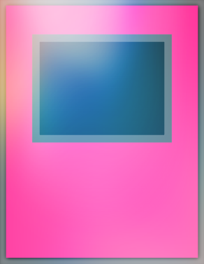

# Bash Duel Homepage

### Carte Trappola consentite nel formato Bash Duel 

### Per vedere le altre carte consentite all'interno del formato segui i link in basso:

[Mostri Normali](../NormalMonsters/MostriNormali.md)

[Mostri Rituale](../RitualMonsters/MostriRituale.md)

[Mostri con Effetto](../EffectMonsters/MostriEffetto.md)

[Mostri dell'Extra Deck](../ExtraDeckMonsters/MostriExtraDeck.md)

[Magie](../Spells/Magie.md)

[Banlist](../README.md)

[Entra nel server Discord di Bash Duel](https://discord.gg/5PpMBYZf)

---

| Trappole:                              |Tipo:                                                     |
|:--------------------------------------:|:--------------------------------------------------------:|
| Annello dell'Eroe                      |  |
| Anfora dell'Avarizia                   |  |
| Annulla Attacco                        |  |
| Arcobaleno Gravitazionale              |  |
| Assalto al Quartier Generale           |  |
| Assenza di Gravità                     |  |
| Attaccati!                             |  |
| Bombardamento di Rocce                 |  |
| Caduta                                 |  |
| Cappelli Magici                        |  |
| Carità Comune                          |  |
| Catena del Destino                     |  |
| Cavaliere Copia                        |  |
| Cerchio Incantatore                    |  |
| Cerchio Incantatore di Pikeru          |  |
| Cerimonia del Sigillo Mokuton          |  |
| Cerimonia del Sigillo di Raiton        |  |
| Circolo del Mago                       |  |
| Conclave Cristallo                     |  |
| Condensatore di Danno                  |  |
| Contrattacco - D                       |  |
| Contrattacco dell'Eroe                 |  |
| Conversione Magnetica                  |  |
| Corno della Bestia Fantasma            |  |
| Coscrizione                            |  |
| Cyber Network                          |  |
| Cyber Ombra Gardna                     |  |
| Dadi del Teschio                       |  |
| Destino-Segnale                        |  |
| Difesa Toon                            |  |
| Distruggi-Anima                        |  |
| Disturbo Magico                        |  |
| Doble Passé                            |  |
| Eliminando la Lega                     |  |
| Emerge un Eroe                         |  |
| Energia Ascendente                     |  |
| Formazione per l'Unione                |  |
| Forza Magnetica                        |  |
| Fune della Vita                        |  |
| Fuoco di Copertura                     |  |
| Garage delle Meraviglie                |  |
| Gatto Quantico                         |  |
| Giara della Cupidigia                  |  |
| Giudizio di Anubi                      |  |
| I Sette Attrezzi del Bandito           |  |
| Imboscata Amazoness                    |  |
| Impulso Limite                         |  |
| Incarnazione di Apophis                |  |
| Ispirazione                            |  |
| Istinto di Caccia                      |  |
| Justi-Frattura                         |  |
| Kunai con Catena                       |  |
| La Tomba del Risveglio                 |  |
| Labirinto dell'Incubo                  |  |
| Lancia e Scudo                         |  |
| Latrato del Sovrano Oscuro             |  |
| Le Mele d'Oro                          |  |
| Legame - DHO                           |  |
| L'Occhio della Verità                  |  |
| Lucenera                               |  |
| Macchina del Tempo                     |  |
| Maschera della Debolezza               |  |
| Maschera di Tutan                      |  |
| Maschera Toon                          |  |
| Metalmorph                             |  |
| Metamorfosi Rara                       |  |
| Metaverso                              |  |
| Michizure                              |  |
| Miniaturizzare                         |  |
| Mistica Barriera della Vita            |  |
| Mucchio Unione                         |  |
| Muro a Specchio                        |  |
| Muro di Disturbo                       |  |
| Muro di Fuoco                          |  |
| Ombra degli Occhi                      |  |
| Onda Elettrica Psichica                |  |
| Ordine di Schianto                     |  |
| Ordini di Attacco Finale               |  |
| Perdita di Memoria                     |  |
| Poltiglia Rifletti-Metalli             |  |
| Posto di Blocco Potente                |  |
| Pronti all'Intercetto                  |  |
| Purificazione Magica                   |  |
| Rabbia Battagliasorvegliante           |  |
| Raigeki Cristallo                      |  |
| Re delle Macchine 3000 A.C.            |  |
| Reliquiario Infestato                  |  |
| Richiamo Emergeroid                    |  |
| Rinascita del Drago                    |  |
| Rinforzi                               |  |
| Rispecchia Palude                      |  |
| Risucchio di Energia                   |  |
| Risucchio Magico                       |  |
| Risvegliare il Drago                   |  |
| Rito dello Spirito                     |  |
| Rovine Diffuse                         |  |
| Ruggito Orgoglioso                     |  |
| Ruota Incubo                           |  |
| Scaglie Corrosive                      |  |
| Scontro Mentale                        |  |
| Scudo Prosciugante                     |  |
| Scudopunta con Catena                  |  |
| Scudopunta con Catena                  |  |
| Sfera della Sicurezza                  |  |
| Sigillo Maledetto della Magia Proibita |  |
| Smog Oscuro                            |  |
| Spada Forza di Luce                    |  |
| Spazzare Via                           |  |
| Spirito Indomito                       |  |
| Spirito Occhi Rossi                    |  |
| Statua del Malvagio                    |  |
| Successore di Abilità                  |  |
| Super Carica                           |  |
| Super Corsa Avventata                  |  |
| Teletrasportatore                      |  |
| Tempesta di Ghiaia                     |  |
| Terreno Riryoku                        |  |
| Teschio di Zoma                        |  |
| Tesoro del Faraone                     |  |
| Tornado di Polvere                     |  |
| Tornado Selvaggio                      |  |
| Tributo Esplosivo                      |  |
| Ululato Selvaggio                      |  |
| Una Grave Sconfitta                    |  |
| Uovo di Ragno                          |  |
| Venditore di Bare                      |  |
| Vento Fatato                           |  |
| Vento Perso                            |  |
| Vita dell'Arcobaleno                   |  |
| Windstorm of Etaqua                    |  |
| Zombie Ladro                           |  |
