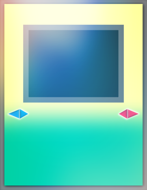

# Bash Duel Homepage

### Mostri con Effetto consentiti per il formato Bash Duel 

### Per vedere le altre carte consentite all'interno del formato segui i link in basso:

[Mostri Normali](../NormalMonsters/MostriNormali.md)

[Mostri Rituale](../RitualMonsters/MostriRituale.md)

[Mostri con Effetto](../effectMonsters/MostriEffetto.md)

[Banlist](../README.md)

[Mostri dell'Extra Deck](../ExtraDeckMonsters/MostriExtraDeck.md)

[Magie](../Spells/Magie.md)

[Trappole](../Traps/Trappole.md)

[Entra nel server Discord di Bash Duel](https://discord.gg/5XVExPRbbJ)

---

| Pendulum Normali: | Tipo: | 
|:-----------------:|:-----:|
| [Tacchino Mite](https://www.db.yugioh-card.com/yugiohdb/card_search.action?ope=2&cid=12393) |  |

